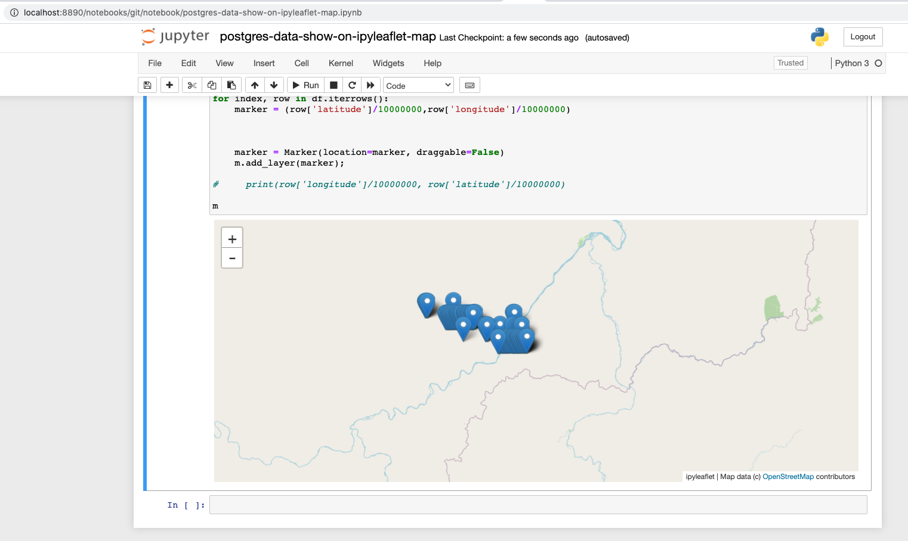

## postgres-data-show-on-ipyleaflet-map.ipynb



# Jupyter notebook for PostgreSQL

- 本專案使用 Jupyter Notebook 來提供 PostgreSQL 的教學文件，可以搭配指定的 PostgreSQL 主機，進行即時互動式的操作。
- 歡迎 PR 提供個人筆記。

## 線上操作

如果你沒有自己的環境，可以直接使用在這裡練習試用：[](https://mybinder.org/v2/gh/pgsql-tw/notebook/master)

- Binder 是即時產生個人操作容器，啟動可能會稍久，請耐心等候。
- 操作過程都是暫存，不會永久保守唷。
- 無法指定資料庫版本。

## 準備

### 下載 PostgreSQL 並安裝。

- [https://www.postgresql.org/download/](https://www.postgresql.org/download/)

### 安裝 Jupyter Notebook

1. 下載 Anaconda 並安裝 (Windows 推薦，亦有 Linux 版)。
   - [https://www.anaconda.com/download/](https://www.anaconda.com/download/)
   - Linux 亦可使用 jupyter-notebook 套件。
2. 安裝 python 套件 - 打開 Anaconda Prompt (確定是安裝到 Anaconda 的環境中)：

```
$ pip install ipython-sql psycopg2
```

- psycopg2 需要 PostgreSQL Server Development 套件，如 Ubuntu/Debian 中的 postgresql-server-dev-XX
- 如果你使用多個 python 環境，請特別注意是否是安裝到 Anaconda 的環境，或是你自有 Notebook 的 python 之中

## 使用

1. 下載本專案，在本機解壓縮（或到[Github](https://github.com/pgsql-tw/notebook)只下載你有興趣的.ipynb 檔）
2. 在 Anaconda 中打開 Jupyter Notebook，切換目錄點選解壓後目錄中的檔案即完成。
3. 筆記範例會真實執行 SQL 指令，請儘量選擇測試或臨時資料庫，以避免影響重要資料。
4. 範例中的「%sql」及「%%sql」為 ipython 的指令，複製 SQL 語法到其他環境時，請避免包含它們。

## Jupyter Notebook Viewer

你也可以使用 [Jupter Notebook Viewer](https://nbviewer.jupyter.org/github/pgsql-tw/notebook/tree/master/) 觀看。

## 參閱

- [ipython-sql](https://github.com/catherinedevlin/ipython-sql): Notebook 裡的 SQL 延伸套件詳細使用方式
- [MADlib library](https://github.com/apache/madlib-site/tree/asf-site/community-artifacts): MADlib 提供的 Notebook 範例集合

## 版權

本筆記由 [PostgreSQL 台灣使用者社群](https://postgresql.tw)提供，採 [CC BY 4.0](https://creativecommons.org/licenses/by/4.0/deed.zh_TW) 授權。
